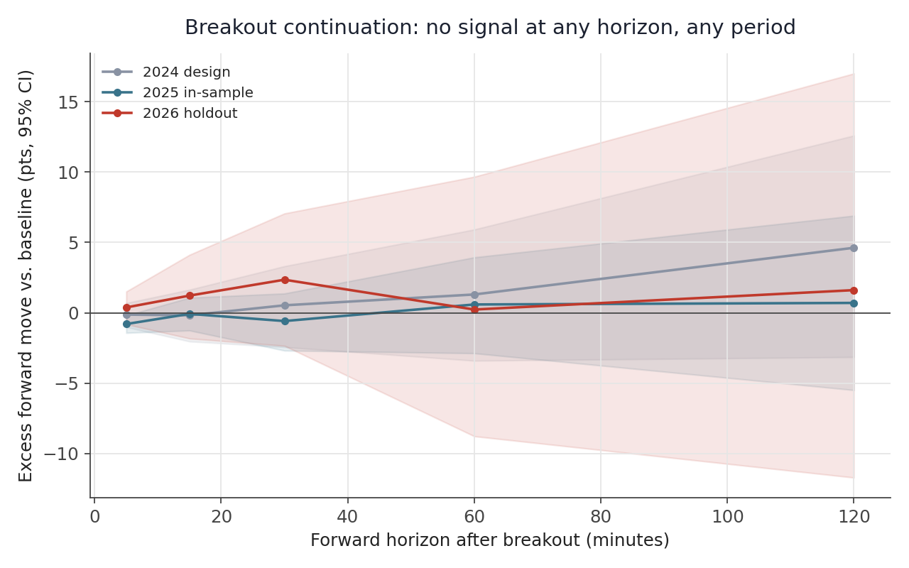
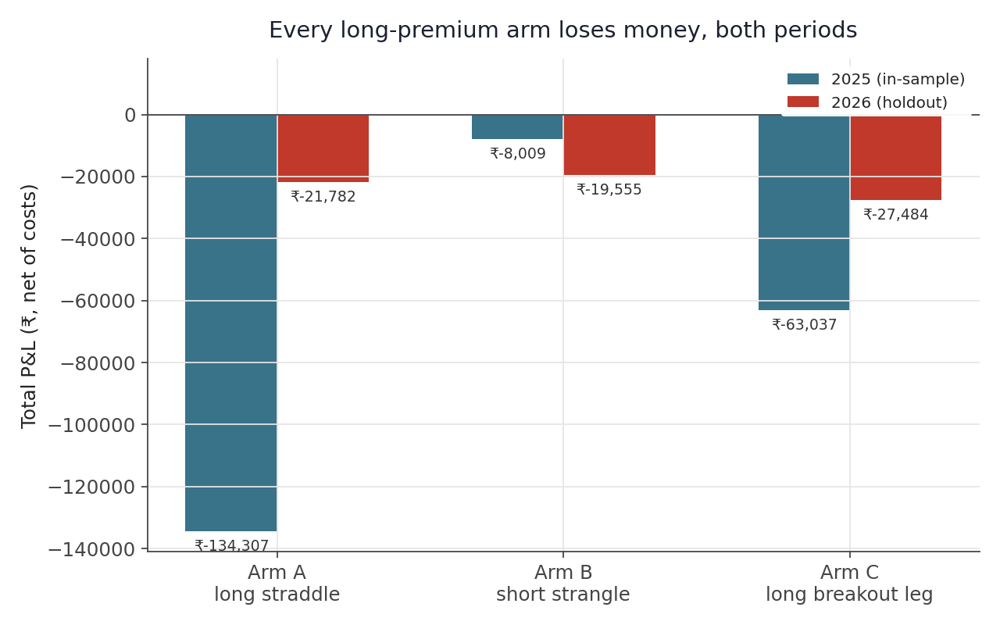
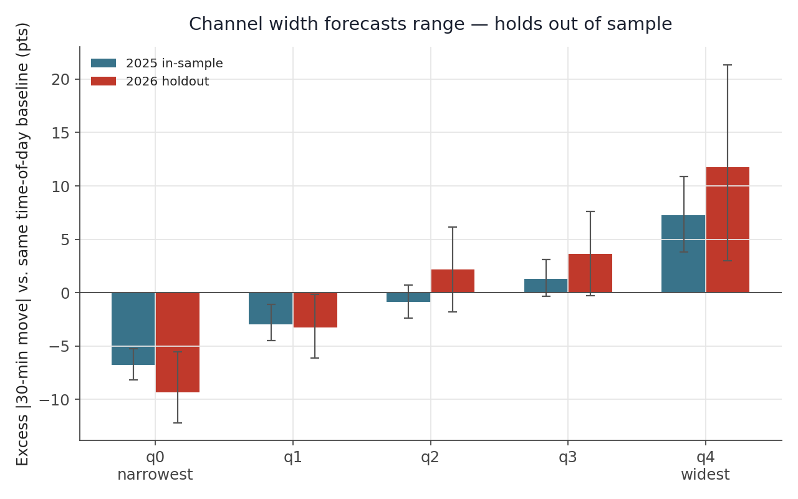
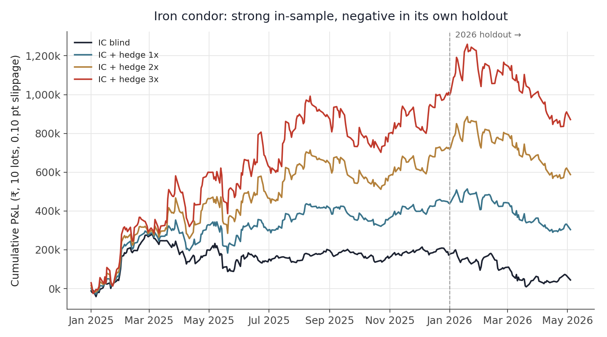
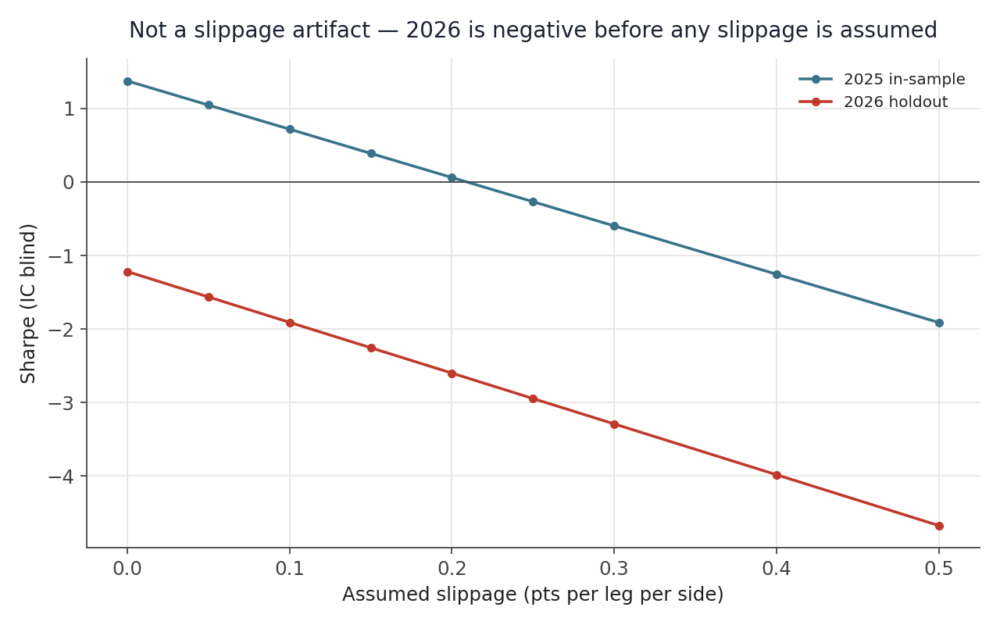

# Donchian + option-buying overlay — a falsification study


[](https://github.com/subbu-31/donchian-option-overlay/actions/workflows/ci.yml)
[](LICENSE)

## Abstract

The Donchian channel breakout is one of the oldest trend-following ideas in
retail trading: wait for price to clear its recent high or low, and treat
that as the start of a move worth riding. It is also, on the NIFTY weekly
options market, worth precisely nothing. This study builds the signal
correctly, prices it against a real weekly option rather than an assumed
payoff, and finds no version of "buy a straddle when the channel breaks"
that survives its own holdout. What does survive is a narrower claim: the
channel's *width* forecasts how large the next move will be, even though it
says nothing about which direction. A second, independent test of the
opposite idea — selling premium instead of buying it — looked profitable
in-sample and reversed sign the moment it met data it had not been fitted
to, which is offered here less as a second finding than as a demonstration
of what an unvalidated backtest looks like before it is validated.

## 1. Introduction

Retail option-selling and option-buying communities in India both treat the
Donchian channel as a timing device — a rule for deciding *when* to put on a
position, layered on top of whatever structure (a bought straddle, a sold
strangle, an iron condor) the trader already favours. The appeal is
obvious: it is simple, it is causal by construction, and a quick look at a
chart usually finds a few breakouts that were followed by a clean move. The
question this project asks is whether that appeal survives contact with
real prices. A breakout signal is not the same thing as a trading result —
between the two sit an option that must actually be bought at a real quoted
price, a bid-ask spread and a brokerage bill that must actually be paid, and
a sample of history that must not have been mined for the rule that happens
to have worked.

The approach taken here is adversarial toward the strategy rather than
sympathetic to it: build the signal first without knowing whether it will
sell straddles or buy them, split the data into a design period, an
in-sample period, and a holdout that is never touched until every choice is
already frozen, and prefer a null result honestly reported over a positive
one that has not been checked for the ways backtests usually lie.

## 2. Data and method

The dataset covers 570 NIFTY 50 spot sessions from January 2024 through
early May 2026, with real option coverage — 1-minute bars, 54,275
near-the-money legs — for 353 of those sessions across 73 weekly expiries.
2024 exists only in spot form and is used to fix every structural choice
(window length, holding period) before a single option price is looked at;
2025 is the in-sample year in which the priced strategies are evaluated;
the first four-plus months of 2026 are held out and touched only after
every cut point from 2025 is locked in.

The channel itself is built causally: at any point in the session it is
defined only by bars strictly before it, and a companion check that
deliberately breaks this rule and looks forward instead produces a result
an order of magnitude larger than the honest one, confirming the pipeline
is not accidentally leaking information it shouldn't have. Every simulated
trade pays the full Zerodha cost stack — brokerage, STT, exchange charge,
SEBI fee, stamp duty, GST, and slippage — applied at the rates actually in
force on that date, since several of these rates changed materially over
the sample period. Because a single trading session produces many
correlated observations rather than independent ones, all statistical
inference is computed with a bootstrap that resamples whole days, not
individual trades.

## 3. Does the breakout carry a signal?

The first and most basic test ignores options entirely and asks whether
price simply keeps moving in the breakout's direction over the minutes and
hours that follow, evaluated separately in each of the three periods so
that a real effect would have to show up more than once:



It does not, at any of the horizons tested, in any of the three periods.
The same question was also asked as a grid of 93 conditioning cells over
other candidate variables in the design period; five came back significant
at the 5% level, against 4.7 expected from chance alone — indistinguishable
from noise.

## 4. Pricing the overlay against a real option

A signal with no measurable edge could still, in principle, make money once
priced against an option, if the option happened to be systematically
mispriced relative to what actually followed. Three long-premium
constructions — a straddle at the breakout, a directional single leg, and a
short-strangle variant included as a counterpoint — were priced against
54,275 real option legs and run through the full cost model:



| | |
|---|---:|
| Straddle round-trip cost | 3.79 pts (1.54% of premium) |
| Clean forward-move placebo, 2,068 events | −0.53 pts (wrong sign, ≈0) |
| Deliberately leaked placebo, 179 events | −49.95 pts (confirms the placebo test itself works) |

Every arm loses money in both the in-sample year and the holdout. Costs are
real but not decisive — even removing them entirely does not flip the sign
of the underlying mean move, and the gap between the clean and
deliberately-leaked placebo confirms the loss is not an artifact of a
signal that is secretly seeing the future.

## 5. The one relationship that survives

One property of the channel does hold up: its width, measured relative to
the same time of day over the prior twenty sessions, forecasts how large
the next move will be, in both the in-sample year and on data the design
choices never saw.



This is a sizing input rather than a trading signal in its own right —
knowing that a big move is coming says nothing about which way it will go —
and it does not translate into buying premium being profitable, because the
option market already prices in the same volatility information the
channel is measuring. The width forecast and the option's implied
volatility are, in effect, two views of the same fact.

## 6. The mirror trade

Having found nothing on the long-premium side, the natural adversarial
question is whether the opposite trade — selling premium instead of buying
it, structured as a delta-selected iron condor with a Donchian buy-stop
used as a hedge rather than an entry signal — does any better, tested under
the same locked-holdout discipline:



| | 2025 (in-sample) | 2026 YTD (holdout) |
|---|---:|---:|
| Blind condor | +₹172,572 | −₹128,239 |
| + hedge, 1x | +₹440,506 | −₹136,574 |
| + hedge, 2x | +₹726,092 | −₹138,490 |
| + hedge, 3x | +₹1,011,681 | −₹140,405 |

The result reverses sign completely between the two periods, and does so
more sharply as the hedge is scaled up — a bigger 2025 gain paired with a
bigger 2026 loss, which is the signature of added gross exposure rather
than of a hedge doing its job.

## 7. Ruling out the two easy explanations

A reversal this clean invites two specific objections before it can be
taken at face value. The first is whether it is simply an artifact of
whatever slippage was assumed:



It is not — the holdout period is already Sharpe-negative at zero assumed
slippage, so no more forgiving cost assumption rescues it. The second
objection is whether the hedge itself is quietly exploiting a forward-look
in how it is gated:

| Hedge-gate placebo | pts | trades | win rate |
|---|---:|---:|---:|
| Clean (real gate) | +0.97 | 518 | 39.6% |
| Random gate | −0.32 | — | — |
| Deliberately leaked gate | −9.21 | — | — |

It is also not — the clean gate's attribution sits close to zero and looks
nothing like the deliberately leaked one, which rules out a forward-looking
cheat but also confirms the hedge was never adding much to begin with.

## 8. Discussion

Neither of the two easy explanations accounts for the reversal, which
leaves the less comfortable one: the specific condor configuration and
hedge style behind the equity curve above were selected from a grid of
roughly thirty variants with no stated rule for the selection, which is
precisely the setup in which the best-looking cell in a grid is often the
one that got lucky in-sample rather than the one that generalises. A
deflated-Sharpe and probability-of-backtest-overfitting check exists
elsewhere in this repository for exactly that failure mode, and has not yet
been run against this particular choice. The honest reading of the
short-premium result is therefore "promising in-sample, not yet validated
out of sample" rather than a second finding to set beside the falsification
of the long-premium overlay.

## 9. Conclusion

A Donchian breakout, overlaid on a bought weekly NIFTY option and priced
against real bars and real costs, does not generate alpha: the underlying
signal shows no directional edge at any horizon or in any period tested,
and every long-premium construction loses money in-sample and out of
sample. The channel's width is a genuine, out-of-sample-stable forecast of
move size, useful for position sizing but not for direction. The
short-premium mirror trade is a cautionary complement to the main result
rather than a rebuttal of it — a strategy that looked strong until it met
data it hadn't been shaped by, kept honest here only because a holdout
period existed to catch it.

Full numeric results live in `results/findings.json` and
`results/ic_findings.json`; the condensed write-up is in
`docs/findings.md`.

## Appendix: running the code

The sections below are a practical reference for reproducing the result
above, not part of the argument itself.

### Data you need to supply

Not bundled. Both come from the weekly Zerodha archives `YYYYMMDD.zip`
(one per weekly expiry, LZMA-compressed):

- `nifty_spot.csv` inside each archive — 1-minute NIFTY 50 bars. Script 01
  stitches and de-duplicates all of them into one continuous series.
- `{strike}{CE|PE}_{expiry}.csv` — 1-minute option bars, columns
  `Timestamp, Open, High, Low, Close, Volume, OI`, `Timestamp` as
  `DD-MM-YYYY HH:MM:SS`.

Point `DL_DIR` at the folder holding the archives (defaults to
`~/mnt/Downloads`) and `STORE_DIR` at where the derived store should live
(defaults to `~/scratch/store`).

### Running it

```
python3 scripts/core/01_build_store.py          # spot parquet + option index
python3 scripts/core/02_spot_grid.py            # 2024 design grid vs random-entry control
python3 scripts/core/03_event_study.py          # conditional vs unconditional forward move
python3 scripts/core/04_conditioning.py         # Q1 direction conditioners, Q2 width -> move size
python3 scripts/core/05_build_option_store.py   # extract near-the-money legs (~257 MB)
python3 scripts/core/06_straddle_by_width.py    # price ~54,000 ATM straddles on real bars
python3 scripts/core/07_analyse_straddle.py     # sort by width quintile, IS/OOS
python3 scripts/core/08_daily_arms.py           # three arms, one decision per session
python3 scripts/core/09_verify.py               # independent re-pricing + look-ahead audit
python3 scripts/core/10_placebo_and_export.py   # forward-leak placebo, findings.json
```

Scripts 02-04 need only 01. Scripts 06-08 need 05. Each caches to `STORE_DIR`,
so re-runs are fast.

`python3 tests/smoke_test.py` builds fabricated weekly-expiry archives with
the same schema and runs 01-08 end to end -- no real data required, no
assertion on trading results, just a check that the pipeline still runs
after a dependency bump or a refactor.

### What the extension scripts test

Act 2's 35 scripts, grouped by what they check:

| Scripts | Theme |
|---|---|
| `iron_condor/` 11-15 | Delta-selected iron condor on the Donchian-triggered entry, its metrics, independent verification, a rotation placebo, and export |
| `extensions/` 16-19 | Spread/slippage cost modelling for the option legs |
| `extensions/` 20-22 | Weekly (vs. daily) holding period, intraday wing behaviour |
| `extensions/` 23-25 | Regime features, regime decomposition, whether IS/OOS split is itself a regime effect |
| `extensions/` 27-29, 33, 37 | Forecast panels/regression on vol and term structure |
| `extensions/` 31, 35, 47 | Cost audit, slippage ladder, time-of-day cost |
| `extensions/` 32, 34 | Term structure, VRP (variance risk premium) state |
| `extensions/` 36, 38 | Skew panel and skew conditioning |
| `extensions/` 39 | Volatility-regime gating |
| `extensions/` 40-41 | Adversarial stress tests and confound checks |
| `extensions/` 43-44 | A harder backtest and a walk-forward that picks structure from past data only |
| `extensions/` 45-46, 48 | Overnight gap behaviour, liquidity/persistence |
| `extensions/` 49-50 | Naked premium selling and its adversarial battery (block bootstrap, deflated Sharpe, PBO, stop-loss overlay, sub-period stability) |

Headline numbers from both bodies of work are synthesised in
`docs/findings.md`.

### Layout

- `lib/core.py` — data loading, 5-minute resampling, day-scoped Donchian
  signals, the 1-minute-path trade simulator, day-clustered bootstrap.
- `lib/features.py` — causal features: channel width relative to the same
  bar-of-day over the prior 20 sessions, breakout extension, opening-range
  expansion, overnight gap.
- `lib/costs.py` / `lib/ic_costs.py` — Zerodha round-trip cost models
  (brokerage, STT, exchange charge, SEBI, stamp, GST, slippage). `costs.py`
  holds the rates flat (used only by `scripts/core/`, whose sample sits
  almost entirely inside one statutory regime -- see
  `scripts/extensions/31_cost_audit.py` for the quantified effect of that
  simplification); `ic_costs.py` is date-aware across the statutory-rate
  changes and is what everything from `scripts/iron_condor/` onward uses.
- `scripts/core/` — the ten-script falsification pipeline (see above).
- `scripts/iron_condor/` — the delta-selected condor + hedge, and its export.
- `scripts/extensions/` — the wider robustness/regime/other-market battery,
  numbered 16-50. Five numbers in that range (26, 30, 42, 51, 52) were
  BankNifty replication scripts, removed once the project's scope settled
  on NIFTY only -- the gap is deliberate, not a missing file.
- `audit/` — independent, from-scratch reimplementations used to cross-check
  the main pipeline.
- `results/` — `findings.json` / `ic_findings.json` plus the per-test CSVs.
- `docs/` — the synthesised write-up.
- `tests/` — a smoke test covering `scripts/core/`.

### Method notes

- The channel at bar *i* uses the *N* bars strictly before *i*, within the same
  session (`shift(1)` before `rolling`). Script 09 proves this with a placebo
  that deliberately builds the channel from future bars.
- Entry is the open of the first 1-minute bar after the signalling 5-minute bar
  closes. Option marks require non-zero volume at entry; staleness is capped at
  three minutes.
- Expiry mapping is the nearest weekly expiry strictly after the session date
  (no 0-DTE).
- 2024 is the design sample, 2025 in-sample, Jan-Apr 2026 a locked holdout with
  every cut point fitted on 2025 and applied verbatim.
- All inference is day-clustered — intraday observations on one session are not
  independent draws.
